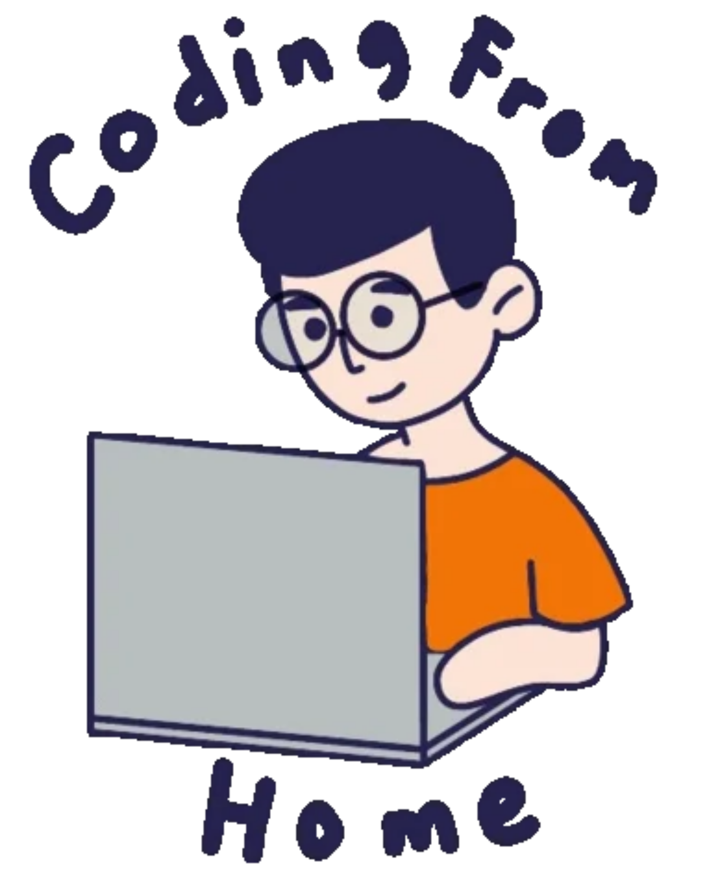

  

  
  
  
  <a href="mailto:<nowiki>agentavery@sample.com?subject=hello danial">
  
  </a>

# Hi there, I'm [Danial Farros Maulana](https://www.linkedin.com/in/danial-farros-maulana-2a46b7212/)  
- 📓 I'm a informatics engineering student of sepuluh nopember institute of technology.
- ♑ I am creatively curious and a self-learner. I love exploring new technologies and currently learning new skills.
- 👨🏻‍💻 I am working at pt include teknologi indonesia and freelance work on several projects.
- 💬 I’m looking forward to contribute to Open Source Projects.

Show ❤ by giving ⭐ to my Repositories, at least your star could make someone's day 😄.

<h1>
  Tech stack 🛠
</h1>

  

<h1>

  Github Statistics 📈
</h1>

 
      
      

  Github achievement 📈
</h1>

